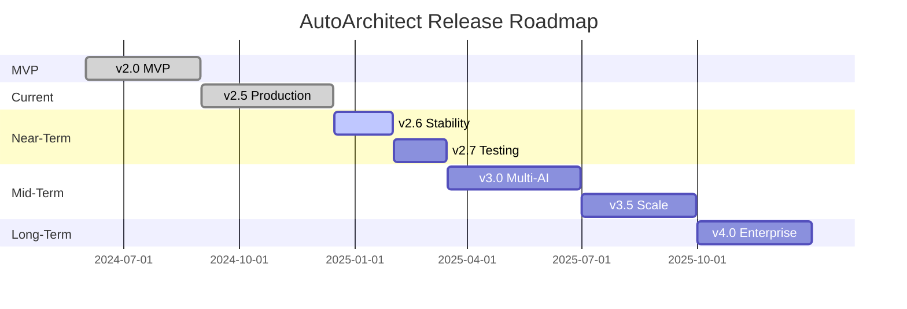

# AutoArchitect Product Roadmap

## Vision Statement

**Mission**: Empower developers, automation engineers, and business users to design, deploy, and manage AI-powered automation workflows with enterprise-grade reliability, security, and developer experience.

**Goals**:
- 🎯 Become the #1 AI-powered automation design platform
- 🚀 Support 50+ automation platforms by v4.0
- 🌐 10,000+ active users by end of 2025
- 📈 90+ Lighthouse score for PWA performance
- 🔒 Zero high-severity security vulnerabilities

---

## Current Status: v2.5 (Production)

### ✅ Shipped Features

**Core Capabilities**:
- ✅ AI-powered automation workflow generation (Zapier, n8n, LangChain, Make, Pipedream)
- ✅ Progressive Web App with offline capability
- ✅ IndexedDB persistence for blueprints and profiles
- ✅ Google Gemini 3 Pro & Flash integration
- ✅ Secure local API key storage with obfuscation

**Advanced Features**:
- ✅ Logic Sandbox for workflow simulation
- ✅ Security & ROI audit engine
- ✅ Deployment Hub with CI/CD generation
- ✅ Platform Comparator
- ✅ Live Architect with real-time voice AI
- ✅ Image analysis for workflow diagrams
- ✅ Text-to-Speech procedure manuals
- ✅ API Terminal for power users
- ✅ Blueprint Vault with versioning

**Technical Foundation**:
- ✅ React 18.2 + TypeScript 5.8
- ✅ Vite 6.2 build system
- ✅ Dexie (IndexedDB) for local storage
- ✅ Service Worker for offline support
- ✅ Responsive Tailwind CSS design

---

## Release Timeline



---

## v2.6: Stability & Polish (Q1 2025)

**Theme**: Bug Fixes, Testing Infrastructure, CI/CD

**Duration**: 6 weeks (Jan 1 - Feb 15, 2025)

### 🎯 Goals
- Zero critical bugs in production
- 80%+ test coverage
- CI/CD pipeline operational
- Improved developer experience

### 📦 Deliverables

#### Testing Infrastructure
- [ ] **Setup Vitest** with React Testing Library
  - Configure test environment
  - Add coverage reporting (target: 80%+)
  - Integrate with CI/CD

- [ ] **Unit Tests (Phase 1)**
  - `geminiService.ts` - 100% coverage
  - `storageService.ts` - 100% coverage
  - Type utilities and helpers

- [ ] **Component Tests (Phase 1)**
  - `Sidebar.tsx`
  - `Header.tsx`
  - Critical UI components

- [ ] **E2E Testing Setup**
  - Install and configure Playwright
  - Create test fixtures
  - Write smoke tests for critical flows

#### CI/CD Pipeline
- [ ] **GitHub Actions Workflows**
  - `ci.yml` - Run tests, linting, type-checking on PRs
  - `security-scan.yml` - Dependency scanning, CodeQL
  - `lighthouse.yml` - PWA performance checks
  - `deploy.yml` - Auto-deploy to Vercel/Netlify

- [ ] **Quality Gates**
  - Enforce 80%+ test coverage
  - Block merges on test failures
  - Require passing Lighthouse scores

- [ ] **Dependabot Configuration**
  - Auto-update dependencies
  - Weekly security scans
  - Auto-merge patch updates

#### Bug Fixes & Improvements
- [ ] **Fix Known Issues**
  - Service worker update mechanism
  - IndexedDB quota handling
  - API rate limiting edge cases
  - Mobile responsiveness issues

- [ ] **Performance Optimizations**
  - Lazy load view components
  - Optimize bundle size (< 500KB gzipped)
  - Implement code splitting
  - Add loading skeletons

- [ ] **Developer Experience**
  - Add ESLint + Prettier configuration
  - Create development documentation
  - Improve error messages
  - Add debug logging utilities

### 📊 Success Metrics
- ✅ 80%+ test coverage achieved
- ✅ CI/CD pipeline running on all PRs
- ✅ Zero critical bugs in production
- ✅ Lighthouse PWA score > 90
- ✅ Bundle size < 500KB gzipped

---

## v2.7: Testing & Quality (Q1 2025)

**Theme**: Comprehensive Testing, Documentation, Accessibility

**Duration**: 6 weeks (Feb 16 - Mar 31, 2025)

### 🎯 Goals
- 90%+ test coverage
- WCAG AA accessibility compliance
- Comprehensive API documentation
- Enhanced user documentation

### 📦 Deliverables

#### Testing (Phase 2)
- [ ] **Unit Tests (Complete)**
  - All service functions
  - All React hooks
  - Utility functions
  - Type guards

- [ ] **Component Tests (Complete)**
  - All views (12 views)
  - All reusable components
  - Error boundaries
  - Loading states

- [ ] **Integration Tests**
  - Workflow generation end-to-end
  - Blueprint save/load/export
  - API key management
  - Offline functionality

- [ ] **E2E Tests (Critical Paths)**
  - User onboarding flow
  - Create and save automation
  - Simulate workflow
  - Audit and deploy
  - Voice interaction (Live Architect)

- [ ] **Visual Regression Tests**
  - Screenshot comparison (Percy or Chromatic)
  - Cross-browser testing
  - Mobile responsive testing

#### Documentation
- [ ] **API Documentation**
  - Complete JSDoc for all services
  - Type definitions documentation
  - Usage examples for all functions

- [ ] **User Guides**
  - Getting started tutorial
  - Feature walkthroughs
  - Video tutorials (5-10 videos)
  - FAQ section

- [ ] **Developer Guides**
  - Architecture deep-dive
  - Contributing guide enhancements
  - Testing guide
  - Deployment guide

- [ ] **Architecture Diagrams**
  - System architecture (Mermaid)
  - Data flow diagrams
  - Component hierarchy
  - Service dependencies

#### Accessibility
- [ ] **WCAG AA Compliance**
  - Semantic HTML throughout
  - ARIA labels for all interactive elements
  - Keyboard navigation support
  - Screen reader testing

- [ ] **Accessibility Audits**
  - axe DevTools audits
  - Manual testing with screen readers
  - Color contrast validation
  - Focus management

### 📊 Success Metrics
- ✅ 90%+ test coverage
- ✅ WCAG AA compliant
- ✅ All APIs documented
- ✅ 10+ video tutorials published
- ✅ Zero accessibility violations

---

## v3.0: Multi-Provider AI (Q2 2025)

**Theme**: Claude Integration, Multi-Provider Architecture

**Duration**: 12 weeks (Apr 1 - Jun 30, 2025)

### 🎯 Goals
- Support multiple AI providers (Gemini + Claude)
- Provider-agnostic architecture
- Enhanced automation capabilities
- Improved cost efficiency

### 📦 Deliverables

#### Multi-Provider Architecture
- [ ] **Provider Interface Design**
  - Define `AIProvider` interface
  - Implement provider factory pattern
  - Add provider selection UI
  - API key management per provider

- [ ] **Claude Integration**
  - Claude API client implementation
  - All 11 agent methods for Claude
  - Vision support (image analysis)
  - Error handling and retries

- [ ] **Provider Management**
  - User preference storage
  - Default provider configuration
  - Per-task provider override
  - Fallback logic on failures

- [ ] **Cost Tracking**
  - Token usage monitoring
  - Cost estimation per provider
  - Budget alerts and limits
  - Cost comparison dashboard

#### Enhanced Features
- [ ] **Intelligent Routing**
  - Auto-select best provider per task
  - Quality-based routing
  - A/B testing for providers

- [ ] **Advanced Prompts**
  - Provider-specific prompt optimization
  - Few-shot learning templates
  - Prompt versioning and testing

- [ ] **Extended Context**
  - Leverage Claude's 200K token context
  - Long document analysis
  - Large workflow optimization

### 📊 Success Metrics
- ✅ Claude fully integrated
- ✅ Provider switching seamless
- ✅ Cost tracking accurate
- ✅ 95%+ user satisfaction
- ✅ 20% cost reduction options

---

## v3.5: Scale & Performance (Q3 2025)

**Theme**: Performance, State Management, Plugin System

**Duration**: 12 weeks (Jul 1 - Sep 30, 2025)

### 🎯 Goals
- Optimize for 10,000+ concurrent users
- Sub-2s page load times
- Extensible plugin architecture
- Advanced offline capabilities

### 📦 Deliverables

#### Performance Optimization
- [ ] **Code Splitting & Lazy Loading**
  - Route-based code splitting
  - Component-level lazy loading
  - Dynamic imports for heavy features
  - Optimize chunk sizes

- [ ] **Service Worker v3**
  - Migrate to Workbox 7
  - Advanced caching strategies
  - Background sync for offline actions
  - Push notifications

- [ ] **Bundle Optimization**
  - Tree-shaking unused code
  - Optimize dependencies
  - Compress assets (gzip/brotli)
  - CDN integration

- [ ] **IndexedDB Optimization**
  - Query indexing strategies
  - Batch operations
  - Data compression
  - Transaction optimization

#### State Management
- [ ] **Zustand Integration**
  - Global state management
  - Persist store to IndexedDB
  - DevTools integration
  - Time-travel debugging

- [ ] **Data Synchronization**
  - Optimistic UI updates
  - Conflict resolution
  - Real-time sync (WebSocket)
  - Multi-device support

#### Plugin System
- [ ] **Plugin Architecture**
  - Plugin API design
  - Sandboxed execution
  - Plugin marketplace
  - Hot reload support

- [ ] **Official Plugins**
  - Custom AI provider plugins
  - Integration connectors (Slack, Discord)
  - Custom workflow templates
  - Analytics and monitoring

### 📊 Success Metrics
- ✅ First Load < 2s on 3G
- ✅ Lighthouse Performance > 95
- ✅ Bundle size < 400KB gzipped
- ✅ 10+ plugins available
- ✅ 10,000+ active users

---

## v4.0: Enterprise Edition (Q4 2025)

**Theme**: Enterprise Features, Team Collaboration, Advanced Analytics

**Duration**: 12 weeks (Oct 1 - Dec 31, 2025)

### 🎯 Goals
- Enterprise-ready features
- Team collaboration capabilities
- Advanced security and compliance
- White-label support

### 📦 Deliverables

#### Collaboration Features
- [ ] **Multi-User Support**
  - User authentication (OAuth, SSO)
  - Role-based access control (RBAC)
  - Team workspaces
  - Shared blueprint libraries

- [ ] **Real-Time Collaboration**
  - Collaborative editing (CRDT)
  - Live cursors and presence
  - Comment threads on blueprints
  - Version history and diffs

- [ ] **Approval Workflows**
  - Review and approval system
  - Change requests
  - Audit trails
  - Compliance reporting

#### Enterprise Security
- [ ] **Enhanced Encryption**
  - End-to-end encryption for blueprints
  - User password-based key encryption
  - Hardware security module (HSM) support
  - Secrets management integration (Vault)

- [ ] **Compliance**
  - SOC 2 Type II certification
  - GDPR compliance
  - HIPAA compliance
  - ISO 27001 alignment

- [ ] **Advanced Auditing**
  - Detailed audit logs
  - Security event monitoring
  - Compliance reports
  - Anomaly detection

#### Advanced Analytics
- [ ] **Usage Analytics**
  - Dashboard with key metrics
  - User behavior tracking
  - Feature usage heatmaps
  - Conversion funnels

- [ ] **AI Insights**
  - Workflow optimization suggestions
  - Cost optimization recommendations
  - Performance bottleneck identification
  - Predictive maintenance

- [ ] **Reporting**
  - Custom report builder
  - Scheduled reports
  - Export to PDF/Excel
  - Executive dashboards

#### White-Label & On-Premise
- [ ] **White-Label Support**
  - Custom branding
  - Custom domains
  - Theme customization
  - API whitelabeling

- [ ] **On-Premise Deployment**
  - Docker containers
  - Kubernetes helm charts
  - Air-gapped installation
  - Self-hosted AI models

### 📊 Success Metrics
- ✅ 100+ enterprise customers
- ✅ SOC 2 certified
- ✅ 99.9% uptime SLA
- ✅ Sub-500ms API response times
- ✅ 50+ integrations

---

## Post-v4.0: Future Innovations (2026+)

### Advanced AI Features
- [ ] **Multi-Modal AI**
  - Video workflow design from recordings
  - Voice-to-workflow generation
  - Augmented reality (AR) workflow visualization

- [ ] **Self-Improving Agents**
  - Learn from user feedback
  - A/B test prompt variations
  - Evolutionary prompt optimization

- [ ] **Agentic Workflows**
  - Autonomous agent orchestration
  - Multi-agent systems (LangGraph integration)
  - Self-healing workflows

### Ecosystem Growth
- [ ] **Marketplace**
  - Public blueprint marketplace
  - Template store
  - Plugin ecosystem
  - Professional services directory

- [ ] **Community**
  - Public Discord/Slack community
  - User-generated content
  - Certification program
  - Annual conference (AutoArchitect Summit)

- [ ] **Integrations**
  - 100+ native integrations
  - Universal connector API
  - Webhook hub
  - Event bus for real-time triggers

### Infrastructure & Scale
- [ ] **Global CDN**
  - Edge computing for AI inference
  - Regional data residency
  - Multi-region deployment
  - 99.99% uptime

- [ ] **Advanced Monitoring**
  - Distributed tracing
  - Real-time performance monitoring
  - AI-powered anomaly detection
  - Self-healing infrastructure

---

## Feature Requests & Community Input

### Top Community Requests
Based on GitHub issues and user feedback:

1. **Export Formats** (Priority: High)
   - Terraform configurations
   - Ansible playbooks
   - Docker Compose files
   - OpenAPI specs

2. **Version Control Integration** (Priority: High)
   - Git integration for blueprints
   - Diff visualization
   - Branch management
   - Pull request workflows

3. **Custom AI Models** (Priority: Medium)
   - Bring your own model (BYOM)
   - Fine-tuned model support
   - Local LLM integration (Ollama)
   - Edge AI deployment

4. **Mobile Apps** (Priority: Medium)
   - Native iOS app
   - Native Android app
   - Tablet optimization
   - Offline-first mobile

5. **Advanced Workflows** (Priority: Medium)
   - Conditional logic builder
   - Loop and iteration support
   - Error handling configuration
   - Parallel execution

### How to Contribute
- 📝 Submit feature requests via [GitHub Issues](https://github.com/Krosebrook/AutoArchtect/issues)
- 💬 Join discussions in [GitHub Discussions](https://github.com/Krosebrook/AutoArchtect/discussions)
- 🗳️ Vote on features using 👍 reactions
- 🛠️ Contribute code via pull requests

---

## Architectural Evolution

### Current Architecture (v2.5)
```
┌─────────────┐
│   Browser   │
└──────┬──────┘
       │
┌──────▼──────────────────────────────────────┐
│  React PWA (Single-Page Application)        │
│  - Views (12 specialized components)        │
│  - Components (reusable UI)                 │
│  - Services (gemini, storage)               │
│  - IndexedDB (Dexie) for persistence       │
│  - Service Worker (offline support)         │
└──────┬──────────────────────────────────────┘
       │
┌──────▼──────┐
│  Google AI  │
│  (Gemini)   │
└─────────────┘
```

### Target Architecture (v4.0)
```
┌─────────────────────────────────────────────┐
│           Load Balancer (Global CDN)        │
└─────────────────┬───────────────────────────┘
                  │
    ┌─────────────┼─────────────┐
    │             │             │
┌───▼───┐    ┌───▼───┐    ┌───▼───┐
│Region │    │Region │    │Region │
│  US   │    │  EU   │    │  APAC │
└───┬───┘    └───┬───┘    └───┬───┘
    │            │            │
    └────────────┼────────────┘
                 │
┌────────────────▼─────────────────────────────┐
│         Application Layer (K8s)              │
│  ┌──────────┐  ┌──────────┐  ┌──────────┐  │
│  │  Web UI  │  │   API    │  │WebSocket │  │
│  │  (React) │  │ Gateway  │  │  Server  │  │
│  └────┬─────┘  └────┬─────┘  └────┬─────┘  │
└───────┼─────────────┼─────────────┼─────────┘
        │             │             │
┌───────▼─────────────▼─────────────▼─────────┐
│            Services Layer                    │
│  ┌──────────┐  ┌──────────┐  ┌──────────┐  │
│  │   Auth   │  │  Workflow│  │Analytics │  │
│  │  Service │  │  Engine  │  │ Service  │  │
│  └────┬─────┘  └────┬─────┘  └────┬─────┘  │
└───────┼─────────────┼─────────────┼─────────┘
        │             │             │
┌───────▼─────────────▼─────────────▼─────────┐
│            Data Layer                        │
│  ┌──────────┐  ┌──────────┐  ┌──────────┐  │
│  │PostgreSQL│  │  Redis   │  │  S3/GCS  │  │
│  │(Primary) │  │  Cache   │  │  Storage │  │
│  └──────────┘  └──────────┘  └──────────┘  │
└───────────────────┬─────────────────────────┘
                    │
┌───────────────────▼─────────────────────────┐
│            AI Providers                      │
│  ┌──────────┐  ┌──────────┐  ┌──────────┐  │
│  │  Gemini  │  │  Claude  │  │  OpenAI  │  │
│  └──────────┘  └──────────┘  └──────────┘  │
└─────────────────────────────────────────────┘
```

---

## Technology Stack Evolution

### v2.5 (Current)
- **Frontend**: React 18.2, TypeScript 5.8, Vite 6.2
- **Database**: IndexedDB (Dexie 3.2.4)
- **AI**: Google Gemini (@google/genai 1.34.0)
- **UI**: Tailwind CSS, Lucide React
- **PWA**: Custom Service Worker

### v3.0 (Planned)
- **Frontend**: React 18.3+, TypeScript 5.9+
- **State**: Zustand or Jotai
- **Testing**: Vitest, Playwright, React Testing Library
- **AI**: Gemini + Claude (multi-provider)
- **PWA**: Workbox 7

### v4.0 (Future)
- **Frontend**: React 19+, TypeScript 5.10+
- **Backend**: Node.js/Bun, Fastify/Hono
- **Database**: PostgreSQL + Redis
- **Infrastructure**: Kubernetes, Docker
- **AI**: Gemini + Claude + OpenAI + Custom
- **Monitoring**: Sentry, DataDog, Prometheus

---

## Investment & Resources

### Team Growth Roadmap

| Quarter | Team Size | Key Hires |
|---------|-----------|-----------|
| Q1 2025 | 3 | QA Engineer |
| Q2 2025 | 5 | Backend Engineer, AI Engineer |
| Q3 2025 | 8 | DevOps, Product Designer, Frontend Engineer |
| Q4 2025 | 12 | Engineering Manager, Sales Engineer, Marketing |

### Budget Allocation

```
Total Budget 2025: $1.2M

├── Engineering (60%): $720K
│   ├── Salaries & Contractors
│   ├── Development Tools & Services
│   └── AI API Credits
│
├── Infrastructure (20%): $240K
│   ├── Cloud Hosting (AWS/GCP)
│   ├── CDN & Edge Computing
│   └── Monitoring & Security Tools
│
├── Marketing & Growth (15%): $180K
│   ├── Content & SEO
│   ├── Community Building
│   └── Events & Partnerships
│
└── Operations (5%): $60K
    ├── Legal & Compliance
    ├── Accounting
    └── Office & Admin
```

---

## Risk Management

### Technical Risks

| Risk | Impact | Probability | Mitigation |
|------|--------|-------------|------------|
| AI API rate limits | High | Medium | Multi-provider, caching, fallbacks |
| Browser compatibility | Medium | Low | Progressive enhancement, polyfills |
| IndexedDB quota | Medium | Medium | Compression, cleanup, cloud sync |
| Security vulnerabilities | High | Low | Audits, dependency scanning, pen testing |
| Performance degradation | Medium | Medium | Monitoring, optimization, load testing |

### Business Risks

| Risk | Impact | Probability | Mitigation |
|------|--------|-------------|------------|
| Low user adoption | High | Medium | Marketing, community building, free tier |
| AI provider pricing changes | Medium | Medium | Multi-provider, negotiation, cost optimization |
| Competitor emergence | Medium | High | Innovation, community, feature velocity |
| Talent acquisition | Medium | Medium | Competitive comp, remote-first, culture |

---

## Success Metrics & KPIs

### Product Metrics
- **Active Users**: 10K by EOY 2025
- **Retention**: 70%+ monthly active users
- **NPS Score**: 50+ (promoter-heavy)
- **Conversion**: 5%+ free-to-paid
- **Churn**: < 5% monthly

### Technical Metrics
- **Lighthouse Score**: 90+ (all categories)
- **Test Coverage**: 90%+ (v2.7+)
- **Uptime**: 99.9% (v4.0+)
- **API Response Time**: < 500ms (p95)
- **Bundle Size**: < 400KB gzipped

### Business Metrics
- **Revenue**: $500K ARR by EOY 2025
- **CAC Payback**: < 6 months
- **Gross Margin**: 80%+
- **Support Ticket Volume**: < 2% of users
- **Customer Satisfaction**: 4.5+ / 5 stars

---

## Conclusion

AutoArchitect is positioned to become the leading AI-powered automation design platform. Our roadmap balances:
- **Short-term stability** (v2.6-2.7): Testing, quality, foundation
- **Mid-term innovation** (v3.0-3.5): Multi-AI, performance, scale
- **Long-term enterprise** (v4.0+): Collaboration, security, white-label

**Key Differentiators**:
- 🤖 Multi-provider AI (Gemini + Claude + more)
- 🔒 Privacy-first, offline-capable architecture
- ⚡ Best-in-class performance and UX
- 🧩 Extensible plugin ecosystem
- 🚀 Fast iteration and community-driven development

---

**Roadmap Version**: 1.0  
**Last Updated**: December 30, 2024  
**Next Review**: March 30, 2025  
**Owner**: Product & Engineering Team  
**Status**: Living Document (updated quarterly)
